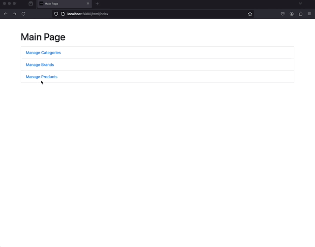
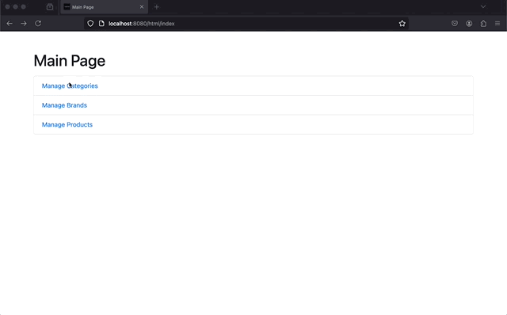
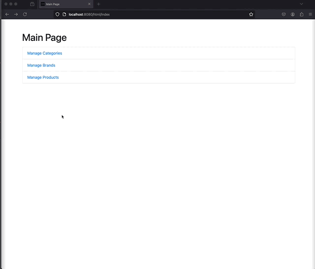
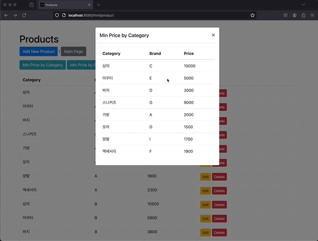
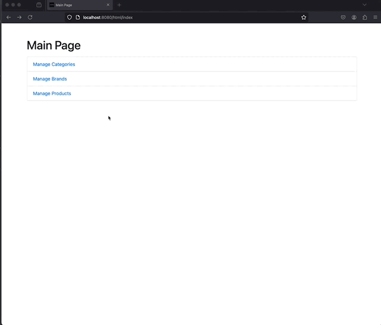
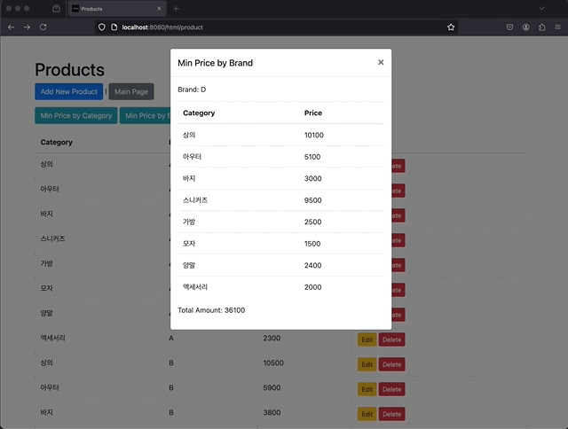
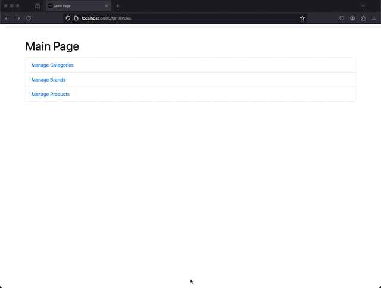
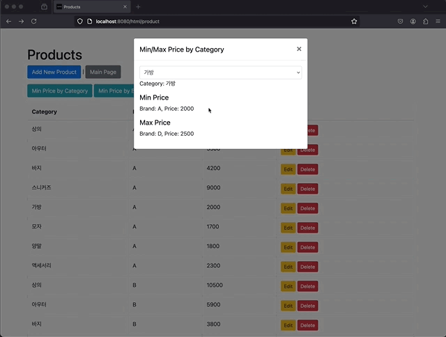
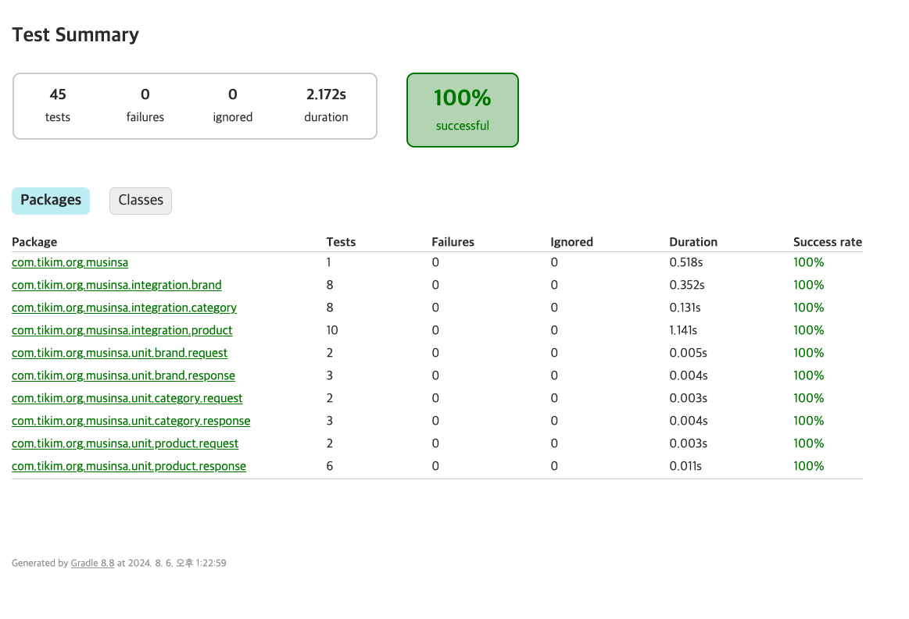

# 무신사 Backend 과제 테스트

## 프로젝트 개요

이 프로젝트는 브랜드, 카테고리 및 상품을 관리하는 시스템입니다. 브랜드와 카테고리를 기반으로 상품을 생성, 조회, 수정, 삭제할 수 있으며, 카테고리별 최소/최대 가격 상품 조회와 브랜드별 최소 가격 상품 조회 기능을 제공합니다.

## 패키지 구조

```
src
├── main
│   ├── java
│   │   └── com
│   │       └── tikim
│   │           └── org
│   │               └── musinsa
│   │                   ├── domain
│   │                   │   ├── brand
│   │                   │   ├── category
│   │                   │   ├── product
│   │                   │   └── index
│   │                   └── global
│   │                       ├── application
│   │                       ├── exception
│   │                       └── swagger  
│   │                   
│   └── resources
│       ├── db
│       │   └── migration
│       │       └── V1__init.sql...
│       ├── static
│       ├── templates
│       │   ├── brand
│       │   ├── category
│       │   ├── product
│       │   └── index
│       ├── log4j2-{env}.xml
│       ├── application.yml
│       └── application-{env}.yml
└── test
    └── java
        └── com
            └── tikim
                └── org
                    └── musinsa
                        ├── integration
                        │   ├── brand
                        │   ├── category
                        │   └── product
                        └── unit
                            ├── brand
                            ├── category
                            └── product
```

## 개발 환경

- **언어**: Java(17)
- **프레임워크**: Spring Boot 3.3.2
- **빌드 도구**: Gradle
- **데이터베이스**: H2 (테스트용)
- **Flyway**: 데이터베이스 마이그레이션 도구
- **Swagger UI**: API 문서를 확인할 수 있습니다.
- **Thymeleaf**: 서버사이드 템플릿 엔진 + ajax


```yaml
# local 프로필 설정
logging:
  config: classpath:log4j2-develop.xml
  level:
    org.flywaydb: debug

spring:
  datasource:
    url: jdbc:h2:mem:testdb;MODE=MySQL
    driverClassName: org.h2.Driver
    username: sa
    password: password
  jpa:
    hibernate:
      ddl-auto: validate
    show-sql: true
    properties:
      hibernate:
        format_sql: true
        show_sql: true
        use_sql_comments: true
  flyway:
    enabled: true
    locations: classpath:db/migration
  h2:
    console:
      enabled: true
      path: /h2-console

# Swagger UI 설정
springdoc:
  api-docs:
    path: /v3/api-docs
  swagger-ui:
    path: /swagger-ui.html
```
---

## 실행 방법

### Gradle 사용

1. **프로젝트 클론**:
   ```sh
   git clone https://github.com/your-repo/musinsa.git
   cd musinsa
   ```

2. **빌드 및 실행**:
   ```sh
   ./gradlew clean build
   ./gradlew bootRun
   ```

3. **Swagger UI 접속**:
   - 브라우저에서 [http://localhost:8080/swagger-ui.html](http://localhost:8080/swagger-ui.html) 접속

4. **H2 콘솔 접속**:
   - 브라우저에서 [http://localhost:8080/h2-console](http://localhost:8080/h2-console) 접속

5. **웹 애플리케이션 접속**:
   - 브라우저에서 [http://localhost:8080/html/index](http://localhost:8080/html/index) 접속

---
## 구현 내용

### 구현 4) CRUD 기능 

브랜드, 카테고리, 상품의 CRUD 기능을 제공합니다. CRUD는 Create(생성), Read(조회), Update(수정), Delete(삭제)를 의미하며, 각각의 엔티티에 대해 이러한 기본적인 기능들을 구현했습니다.
#### 메인 페이지(http://localhost:8080/html/index)

#### 브랜드 관리
- **브랜드 페이지**: http://localhost:8080/html/brand
- **swagger-ui**: http://localhost:8080/swagger-ui/index.html#/brand-controller

- **생성**: 새로운 브랜드를 생성합니다.
- **조회**: 모든 브랜드를 조회하거나 특정 브랜드를 ID로 조회합니다.
- **수정**: 기존 브랜드를 수정합니다.
- **삭제**: 브랜드를 삭제합니다.

#### 카테고리 관리
- **카테고리 페이지**: http://localhost:8080/html/category
- **swagger-ui** : http://localhost:8080/swagger-ui/index.html#/category-controller

- **생성**: 새로운 카테고리를 생성합니다.
- **조회**: 모든 카테고리를 조회하거나 특정 카테고리를 ID로 조회합니다.
- **수정**: 기존 카테고리를 수정합니다.
- **삭제**: 카테고리를 삭제합니다.

#### 상품 관리
- **상품 페이지**: http://localhost:8080/html/product
- **swagger-ui**: http://localhost:8080/swagger-ui/index.html#/product-controller

- **생성**: 새로운 상품을 생성합니다.
- **조회**: 모든 상품을 조회하거나 특정 상품을 ID로 조회합니다.
- **수정**: 기존 상품을 수정합니다.
- **삭제**: 상품을 삭제합니다.

---

### 구현 1) 카테고리별 최소/최대 가격 상품 조회
카테고리별로 최소 가격과 최대 가격의 상품을 조회하는 기능을 제공합니다. 
- **상품 페이지**: http://localhost:8080/html/product
- **swagger-ui**: http://localhost:8080/swagger-ui/index.html#/product-controller/getMinPriceProductsByCategory

**쿼리:**
```java
@Query(value = "WITH MinPricePerCategory AS ( " +
    "    SELECT category_id, MIN(price) AS min_price " +
    "    FROM product " +
    "    GROUP BY category_id), " +
    "RankedProducts AS ( " +
    "    SELECT p.id, ROW_NUMBER() OVER (PARTITION BY p.category_id ORDER BY p.id DESC) as r " +
    "    FROM product p " +
    "    JOIN MinPricePerCategory mpc ON p.category_id = mpc.category_id AND p.price = mpc.min_price) " +
    "SELECT c.name AS categoryName, b.name AS brandName, p.price AS price " +
    "FROM product p " +
    "JOIN RankedProducts rp ON p.id = rp.id AND rp.r = 1 " +
    "JOIN brand b ON p.brand_id = b.id " +
    "JOIN category c ON p.category_id = c.id " +
    "ORDER BY c.id ASC;", nativeQuery = true)
List<MinPriceProductByCategory> findMinPriceProductsByCategory();
```

**의도 및 장점:**
- **조건 분리와 조합**: 첫 번째 CTE (Common Table Expression)인 `MinPricePerCategory`에서 각 카테고리의 최소 가격을 구하고, 두 번째 CTE `RankedProducts`에서 최소 가격과 매칭되는 상품을 랭킹으로 정렬하여 중복을 제거합니다.
- **중복 제거**: 동일한 가격의 상품이 여러 개 있을 수 있어 이를 `ROW_NUMBER()`를 사용하여 중복을 제거합니다.
- **효율적인 데이터 조회**: 마지막으로 필요한 데이터를 조인하여 최종 결과를 도출합니다. 이렇게 하면 불필요한 중복을 제거하고 최적의 데이터를 조회할 수 있습니다.

**Edge Cases Handling:**
- **동일 가격 상품 처리**: 동일한 가격의 상품이 여러 개 있을 때 상품 ID의 역순으로 정렬하여 하나의 상품만 선택합니다.


---

### 구현 2) 단일 브랜드로 모든 카테고리 상품을 최저가에 구매할 때의 브랜드와 가격 조회
단일 브랜드로 모든 카테고리의 상품을 최저가에 구매할 때 최저 가격을 제공하는 브랜드와 해당 카테고리의 상품 가격 및 총액을 조회하는 기능을 제공합니다.
- **상품 페이지**: http://localhost:8080/html/product
- **swagger-ui**: http://localhost:8080/swagger-ui/index.html#/product-controller/getMinPriceProductsByBrand


**쿼리:**
```java
@Query(value = "WITH CategoryMinPrices AS ( " +
    "    SELECT p.category_id, p.brand_id, MIN(p.price) AS min_price " +
    "    FROM product p " +
    "    GROUP BY p.category_id, p.brand_id " +
    "), " +
    "BrandPriceRanking AS ( " +
    "    SELECT cmp.brand_id, SUM(cmp.min_price) AS total_price, ROW_NUMBER() OVER (ORDER BY SUM(cmp.min_price) ASC, cmp.brand_id) as r " +
    "    FROM CategoryMinPrices cmp " +
    "    GROUP BY cmp.brand_id " +
    "    HAVING COUNT(DISTINCT cmp.category_id) = (SELECT COUNT(*) FROM category)) " +
    "SELECT b.name AS brandName, c.name AS categoryName, cmp.min_price AS price " +
    "FROM CategoryMinPrices cmp " +
    "JOIN BrandPriceRanking bpr ON cmp.brand_id = bpr.brand_id AND bpr.r = 1 " +
    "JOIN brand b ON cmp.brand_id = b.id " +
    "JOIN category c ON cmp.category_id = c.id " +
    "ORDER BY c.id ASC;", nativeQuery = true)
List<MinPriceProductByBrand> findMinPriceProductsByBrand();
```

**의도 및 장점:**
- **모든 카테고리 조건**: 브랜드가 모든 카테고리에 해당하는 상품을 갖추고 있어야만 최저가 브랜드로 선택될 수 있도록 `HAVING COUNT(DISTINCT cmp.category_id) = (SELECT COUNT(*) FROM category)` 조건을 추가했습니다.
- **최적의 브랜드 선정**: 각 브랜드의 카테고리별 최소 가격을 구하고, 그 합계를 기준으로 최적의 브랜드를 선정합니다.
- **효율성**: 조건을 만족하는 브랜드를 먼저 필터링하고 최종적으로 필요한 데이터를 조인하여 조회합니다.

**Edge Cases Handling:**
- **브랜드별 상품 존재 유무**: 특정 브랜드가 모든 카테고리에 대한 상품을 갖추고 있지 않으면 제외됩니다.


---

### 구현 3) 카테고리 이름으로 최소, 최고 가격 브랜드와 상품 가격 조회
특정 카테고리의 최소 가격과 최고 가격의 브랜드 및 상품 가격을 조회하는 기능을 제공합니다.
- **상품 페이지**: http://localhost:8080/html/product
- **swagger-ui**: http://localhost:8080/swagger-ui/index.html#/product-controller/getCategoryMinMaxPrice


**쿼리:**
```java
@Query(value = "WITH MinPricePerCategory AS ( " +
    "    SELECT p.brand_id, MIN(p.price) AS min_price " +
    "    FROM product p WHERE p.category_id = :categoryId " +
    "    GROUP BY p.brand_id " +
    "    ORDER BY min_price ASC, p.brand_id DESC " +
    "    LIMIT 1) " +
    "SELECT b.name AS brandName, mpc.min_price AS price " +
    "FROM MinPricePerCategory mpc " +
    "JOIN brand b ON mpc.brand_id = b.id", nativeQuery = true)
Optional<CategoryMinMaxPrice> findMinPriceByCategory(@Param("categoryId") Long categoryId);

@Query(value = "WITH MaxPricePerCategory AS ( " +
    "    SELECT p.brand_id, MAX(p.price) AS max_price " +
    "    FROM product p WHERE p.category_id = :categoryId " +
    "    GROUP BY p.brand_id " +
    "    ORDER BY max_price DESC, p.brand_id DESC " +
    "    LIMIT 1) " +
    "SELECT b.name AS brandName, xpc.max_price AS price " +
    "FROM MaxPricePerCategory xpc " +
    "JOIN brand b ON xpc.brand_id = b.id", nativeQuery = true)
Optional<CategoryMinMaxPrice> findMaxPriceByCategory(@Param("categoryId") Long categoryId);
```

**의도 및 장점:**
- **최소/최고 가격 조회 분리**: 최소 가격과 최대 가격 조회를 별도의 쿼리로 분리하여 각각의 최소/최고 가격 상품을 명확하게 조회할 수 있도록 했습니다.
- **중복 제거**: 동일한 가격의 상품이 있을 경우 `ORDER BY price ASC, brand_id DESC`를 사용하여 중복을 제거하고 하나의 상품만 선택합니다.
- **효율적인 데이터 조회**: 각 쿼리에서 조건을 만족하는 데이터를 먼저 필터링하고 최종 결과를 조인하여 효율적으로 조회합니다.

**Edge Cases Handling:**
- **동일 가격 상품 처리**: 동일한 가격의 상품이 여러 개 있을 경우 브랜드 ID의 역순으로 정렬하여 중복을 예방합니다.


---

## 테스트

### 통합 테스트와 유닛 테스트

프로젝트에서는 엔터티에 대해 CRUD 및 비즈니스 로직을 검증하는 통합 테스트와, DTO 변환 과정을 검증하는 유닛 테스트를 제공합니다. 

- **통합 테스트**: 서비스 함수를 테스트하고 반복적인 테스트 수행이 가능하도록 실행 전 데이터베이스를 초기화하는 작업을 진행합니다.
- **유닛 테스트**: 컨트롤러에서 사용하는 DTO 변환 과정을 테스트하며, 이때는 데이터베이스가 필요 없기 때문에 사전 작업이 존재하지 않습니다.
- **서비스 함수에 대한 유닛 테스트**는 통합 테스트에서 검증하기 때문에 별도로 작성하지 않았습니다.

#### 예시: Product 통합 테스트

```java
@SpringBootTest
@Transactional
public class ProductServiceIntegrationTest {

    @Autowired
    private ProductService productService;

    @Autowired
    private ProductRepository productRepository;

    @Autowired
    private TestSetupUtil testSetupUtil;

    @BeforeEach
    void setUp() {
        testSetupUtil.setUp();
    }

    @Test
    @DisplayName("브랜드별 최소 가격 상품 조회 통합 테스트")
    void testGetMinPriceByBrand() {
        ProductServiceMinPriceByBrandResponse response = productService.getMinPriceProductsByBrand();
        // 테스트 검증 로직
    }
}
```

---

이 README.md 파일은 프로젝트의 개요, 패키지 구조, 개발 환경 설정, 구현 내용, 실행 방법 및 테스트에 대한 정보를 제공합니다.